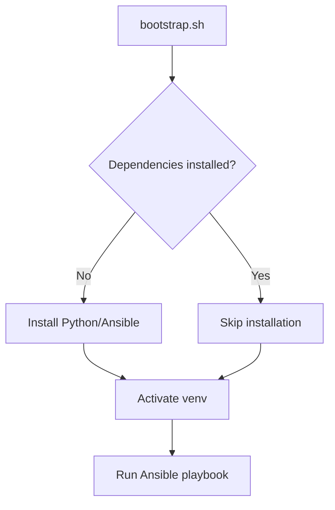

# Architecture Overview

This document explains the design principles, component architecture, and data flow of the dotfiles management system.

## Design Philosophy

### Core Principles

1. **Single Entry Point**: `bootstrap.sh` is the only way to provision
2. **Declarative Configuration**: Ansible manages state, not shell scripts
3. **Clear Separation**: Strict boundaries between system-managed and user-managed files
4. **Idempotent Operations**: Safe to run multiple times without side effects
5. **Fail-Safe Defaults**: Backups before changes, dry-run mode available

### Why This Architecture?

**Before** (Traditional Dotfiles):
- Shell scripts with manual symlinking
- Hard to maintain consistency across machines
- No rollback capability
- Difficult to test changes

**After** (This System):
- Declarative Ansible playbooks
- Guaranteed consistency
- Automatic backups
- Testable with dry-run mode

## System Components

```
┌─────────────────────────────────────────────────────┐
│                   User Interface                    │
│                  bootstrap.sh                       │
│         (Installation & Prerequisite Setup)         │
└──────────────────┬──────────────────────────────────┘
                   │
                   ▼
┌─────────────────────────────────────────────────────┐
│              Automation Layer                       │
│           ansible/playbook.yml                      │
│     (Orchestrates provisioning workflow)            │
└──────────────────┬──────────────────────────────────┘
                   │
                   ▼
┌─────────────────────────────────────────────────────┐
│                Role: dotfiles                       │
│    ansible/roles/dotfiles/tasks/main.yml           │
│   • Package installation                            │
│   • Repository cloning                              │
│   • Oh My Zsh setup                                 │
│   • Configuration linking                           │
│   • Shell configuration                             │
└──────────────────┬──────────────────────────────────┘
                   │
                   ▼
┌─────────────────────────────────────────────────────┐
│          Configuration Files                        │
│  • zsh/        - Zsh configuration modules          │
│  • git/        - Git configuration                  │
│  • vim/        - Vim configuration                  │
│  • bin/        - Utility scripts                    │
└─────────────────────────────────────────────────────┘
                   │
                   ▼
┌─────────────────────────────────────────────────────┐
│            Runtime System                           │
│  • ~/.zshrc          (symlink → repo)               │
│  • ~/.zshrc.local    (user-owned)                   │
│  • ~/.gitconfig      (symlink → repo)               │
│  • ~/.vimrc          (symlink → repo)               │
└─────────────────────────────────────────────────────┘
```

## Component Details

### 1. Bootstrap Script (`bootstrap.sh`)

**Purpose**: Minimal prerequisite setup before Ansible takes over

**Responsibilities**:
- Detect OS and package manager
- Install Python 3 and pip
- Install Ansible in virtual environment
- Parse command-line arguments
- Invoke Ansible playbook

**Design Decision**: Keep minimal. Don't duplicate Ansible's work.



### 2. Ansible Playbook (`ansible/playbook.yml`)

**Purpose**: Main orchestration layer

**Structure**:
```yaml
Pre-tasks:
  - Create backup directory

Roles:
  - dotfiles (main provisioning)

Post-tasks:
  - Display success message
```

**Variables**:
- `dotfiles_dir`: Location of repository
- `install_deps`: Whether to install packages
- `set_default_shell`: Whether to change shell to zsh
- `backup_dir`: Where to store backups

### 3. Dotfiles Role

**Purpose**: All actual configuration management

**Task Groups** (tagged for selective execution):

#### `packages` Tag
- Detect OS family
- Install system dependencies
- Handle different package managers (apt/dnf/pacman)
- Install fonts for Powerlevel10k

#### `repo` Tag
- Clone dotfiles repository (if needed)
- Update existing repository

#### `omz` Tag
- Install Oh My Zsh framework
- Install Oh My Zsh plugins
- Configure Powerlevel10k theme

#### `config` Tag
- Link configuration files
- Generate ~/.zshrc.local from template
- Set up bin scripts
- Create necessary directories

#### `shell` Tag
- Detect zsh location
- Change default shell
- Handle non-interactive scenarios

### 4. Configuration Files

#### Zsh Structure

```
zsh/
├── zshrc.d/              # Modular configuration
│   ├── 00-omz.zsh        # Oh My Zsh initialization
│   ├── 05-dotfiles-updates.zsh  # Auto-update hooks
│   ├── 10-aliases.zsh    # Command aliases
│   ├── 15-functions.zsh  # Custom functions
│   ├── 20-keybindings.zsh # Keyboard shortcuts
│   ├── 30-env.zsh        # Environment variables
│   └── 99-p10k.zsh       # Powerlevel10k theme
└── omz-custom/           # Oh My Zsh customizations
    ├── plugins/          # Custom plugins
    └── themes/           # Custom themes
```

**Loading Order**: Files are sourced numerically (00 → 99)

#### Template System

The role uses Jinja2 templates for dynamic configuration:

```jinja2
# ~/.zshrc.local (generated once, never updated)
# Machine-specific configuration
# This file is YOURS - repo will never overwrite it

# Add your custom configuration here
```

### 5. Update Management System

**Components**:
- `dotfiles-check-updates.sh` - Periodic check for upstream changes
- `dotfiles-pull-updates.sh` - Manual update trigger
- `.last_update_check` - Timestamp file

**Flow**:
```
Shell startup
    ↓
05-dotfiles-updates.zsh sources
    ↓
dotfiles-check-updates.sh runs
    ↓
Check .last_update_check
    ↓
If > 7 days → git fetch
    ↓
Compare HEAD with @{upstream}
    ↓
If behind → Notify or auto-update
```

**Configuration**:
- `ZSH_DOTFILES_UPDATE_FREQ`: Days between checks (default: 7)
- `ZSH_DOTFILES_AUTOUPDATE`: Auto-pull or just notify (default: false)

## Data Flow

### Initial Provisioning

```
1. User runs ./bootstrap.sh
2. Bootstrap installs Ansible
3. Bootstrap calls ansible-playbook
4. Playbook creates backup directory
5. Playbook invokes dotfiles role
6. Role installs packages
7. Role installs Oh My Zsh
8. Role links config files (backs up existing)
9. Role generates ~/.zshrc.local
10. Role changes default shell
11. User runs 'exec zsh'
12. Zsh sources ~/.zshrc
13. ~/.zshrc sources all zshrc.d/*.zsh files
14. Shell is ready
```

### Update Flow

```
1. Shell startup or manual trigger
2. dotfiles-check-updates.sh runs
3. If due for check:
   a. git fetch origin
   b. Count commits behind
   c. If behind and autoupdate=true: git pull
   d. If behind and autoupdate=false: notify user
4. User can run dotfiles-pull-updates.sh manually
5. Pull updates from origin
6. Re-run Ansible playbook (optional)
```

### Configuration Sourcing

```
~/.zshrc (symlink)
  ↓
Loop through ~/.dotfiles/zsh/zshrc.d/*.zsh
  ↓
00-omz.zsh (initialize Oh My Zsh)
  ↓
05-dotfiles-updates.zsh (update checks)
  ↓
10-aliases.zsh (command aliases)
  ↓
15-functions.zsh (custom functions)
  ↓
20-keybindings.zsh (keyboard shortcuts)
  ↓
30-env.zsh (environment variables)
  ↓
99-p10k.zsh (theme configuration)
  ↓
~/.zshrc.local (user's custom config)
```

## Security Considerations

### Backup Strategy
- All overwrites create timestamped backups
- Backups stored in `~/.dotfiles-backups/`
- Format: `filename.YYYY-MM-DD_HH-MM-SS`

### Privilege Escalation
- Bootstrap auto-detects `sudo` or `doas`
- Only required for package installation
- Ansible uses `become: true` for system tasks

### Secret Management
- Secrets go in `~/.zshrc.local` (not in repo)
- `.gitignore` prevents accidental commits
- Templates create files with secure permissions (0600)

## Extension Points

### Adding New Configuration Types

1. Create configuration directory (e.g., `tmux/`)
2. Add configuration file (e.g., `tmux/.tmux.conf`)
3. Update `ansible/roles/dotfiles/tasks/main.yml`:
   ```yaml
   - name: Link tmux configuration
     ansible.builtin.file:
       src: "{{ dotfiles_dir }}/tmux/.tmux.conf"
       dest: "{{ ansible_env.HOME }}/.tmux.conf"
       state: link
       force: true
   ```

### Adding Zsh Modules

1. Create file in `zsh/zshrc.d/` with numeric prefix
2. Follow naming convention: `NN-name.zsh`
3. Lower numbers load first
4. Files are automatically sourced by `.zshrc`

### Adding Oh My Zsh Plugins

1. Update `ansible/roles/dotfiles/tasks/main.yml`:
   ```yaml
   - name: Clone custom OMZ plugin
     ansible.builtin.git:
       repo: https://github.com/author/plugin-name
       dest: "{{ omz_custom }}/plugins/plugin-name"
   ```

2. Reference in `zsh/zshrc.d/00-omz.zsh`:
   ```bash
   plugins=(... plugin-name)
   ```

## Performance Considerations

- **Lazy Loading**: Heavy plugins should be lazy-loaded
- **Update Frequency**: Default 7-day check interval balances freshness vs overhead
- **Parallel Installation**: Ansible handles concurrent tasks where safe
- **Caching**: Ansible cache_valid_time reduces repeated package index updates

## Testing Strategy

- **Dry-run mode**: `--dry-run` flag previews changes
- **Tags**: Selective execution for testing specific components
- **Idempotency**: Re-running should be safe and fast
- **Backup validation**: Verify backups before major changes

## Troubleshooting Architecture

### Log Locations
- Ansible: stdout during playbook run
- Update checks: stderr visible in shell
- Bootstrap: stdout during execution

### State Files
- `.last_update_check` - Update check timestamp
- `.update.lock` - Prevents concurrent updates
- `~/.dotfiles-backups/` - All backup files

### Recovery Points
1. Git repository (version control)
2. Backup directory (file-level)
3. System package manager (package-level)

## Future Architecture Considerations

### Scalability
- Multi-machine management via Ansible inventory
- Centralized configuration with host-specific overrides
- Remote provisioning over SSH

### Modularity
- Split roles by concern (shell, editor, git)
- Plugin system for community contributions
- Dynamic module loading

### Cross-Platform
- Platform-specific task inclusion
- Unified interface across Linux/macOS/Windows (WSL)
- Graceful degradation for missing features

---

This architecture balances simplicity, safety, and extensibility while maintaining a clear separation of concerns.
